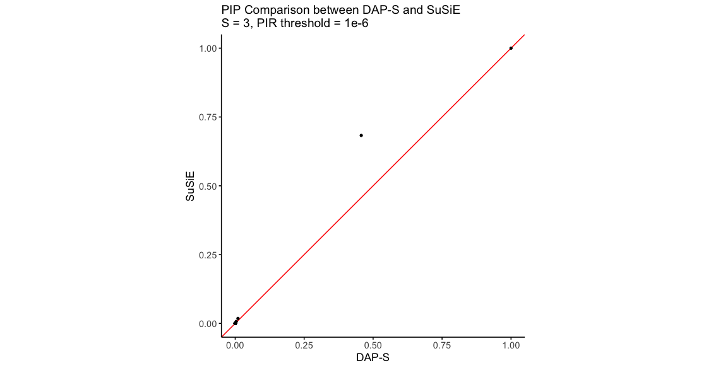

# DAP-S: Deterministic Approximation of Posteriors with Pseudo Importance Resampling

## Overview

In genetic fine mapping, identifying causal variants remains a key challenge due to computational limitations. Here, we introduce a novel method, DAP-S, which builds upon the Sum of Single Effects (SuSiE) results by integrating pseudo-importance resampling (PIR) to efficiently explore models with high probability. Specifically, DAP-S leverages SuSiE's variational approximation to identify high-priority SNPs in independent effects and refines posterior probabilities through the deterministic approximation of posteriors (DAP) based on pseudo importance resampling (PIR) strategy.

## Installation

The `dap` package implements the algorithm of DAP-S. You can install the development version of `dap` from GitHub.

``` r
# install DAP-S package via devtools
install.packages("devtools")
devtools::install_github("wnbo9/DAP-S/dap")

# or install DAP-S source package
install.packages("dap_0.2.0.tar.gz", repos = NULL, type="source")

# load the package
library(dap)
```

## Usage
``` r
# setting
library(dap)
library(susieR)
library(ggplot2)
set.seed(2024)
n <- 1000
p <- 5000
tau <- 1
phi <- 0.6
S <- 3

# generate genotype, effect variants, and phenotype data
X <- matrix(rnorm(n*p, mean = 0, sd = 1), nrow = n, ncol = p)
colnames(X) <- paste0("SNP_", 1:p)
# generate effect size
gv <- rep(0, p)
causal_set <- sample(1:p, S)
gv[causal_set] <- 1
bv <- rnorm(p, sd=phi/sqrt(tau))
bv <- bv*gv
yhat <- X%*%bv
y <- yhat + rnorm(n, sd=1/sqrt(tau))

X <- scale(X, scale = FALSE)
y <- scale(y, scale = FALSE)

# run susie
rst1 <- susie(X, y, L = 10, max_iter = 1000, coverage = 0.95, null_weight = (1-1/p)^p)
# run dap
rst2 <- dap(X, y, L = 10)

# comparison
data_all <- data.frame(SuSiE = rst1$pip, DAP = rst2$variants$PIP[order(as.numeric(gsub("SNP_", "", rst2$variants$SNP)))])
ggplot(data_all, aes(x = DAP, y = SuSiE)) +
  geom_abline(intercept = 0, slope = 1, color = "red", size = 0.5) +
  geom_point(size = 1) +
  labs(x = "DAP-S", y = "SuSiE", title = paste0("PIP Comparison between DAP-S and SuSiE\nS=", S, ", threshold=", 1e-6)) +
  scale_color_identity() + coord_fixed(ratio = 1) + xlim(0, 1) + ylim(0, 1) +
  theme_minimal() +
  theme(panel.grid.major = element_blank(),panel.grid.minor = element_blank(),panel.border = element_blank(),axis.line = element_line(color = "black"),axis.title.x = element_text(size = 12, hjust = 0.5),axis.title.y = element_text(size = 12, angle = 90),axis.text = element_text(size = 10),axis.ticks = element_line(color = "black")
  )
```
<div style="text-align: center;">
  
</div>